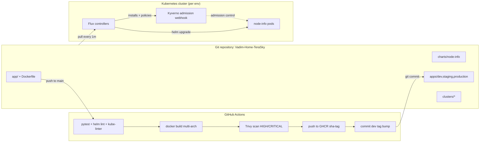
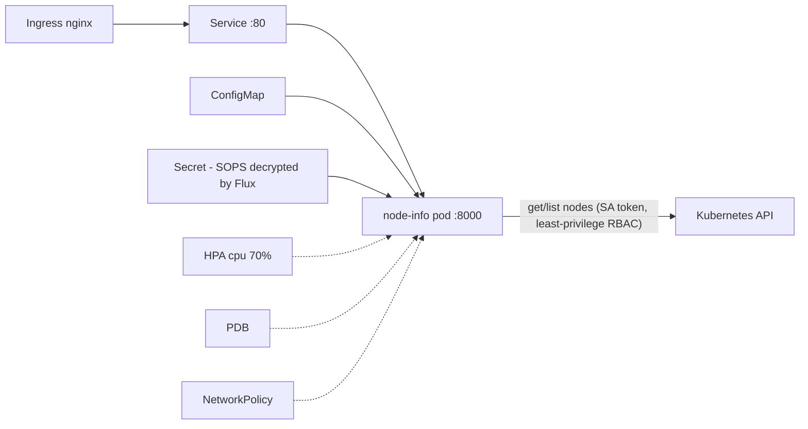
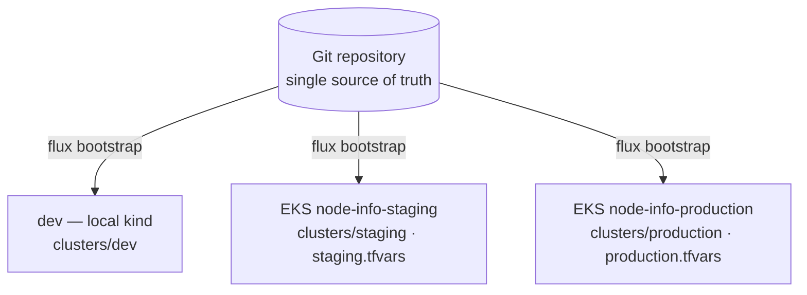

# Vadim-Home-TeraSky — Kubernetes GitOps Platform

Reference implementation for the DevOps Engineer home assignment: a Python
backend deployed to Kubernetes with **Flux GitOps**, CI on GitHub Actions,
SOPS-encrypted secrets, and Kyverno policy enforcement. This README is the
single document for the whole solution.

## Architecture

*Assignment §8 — the architecture diagrams: how a change travels, and what runs where.*



Runtime (per environment namespace):



## The application

*Assignment §2 — the backend service, its two required endpoints, and least-privilege access to the Kubernetes API.*

- `GET /health` — health status; backs the liveness and readiness probes.
- `GET /nodes` — lists cluster nodes and marks the node the serving pod
  runs on (`NODE_NAME` injected via the Downward API).
- `GET /metrics` — Prometheus metrics: request counts and latency.

The pod talks to the Kubernetes API with a dedicated ServiceAccount bound
to a ClusterRole that allows only `get`/`list` on `nodes` (nodes are
cluster-scoped, so a ClusterRole is required). Verified:

```bash
kubectl auth can-i list nodes   --as=system:serviceaccount:node-info-dev:node-info    # yes
kubectl auth can-i list secrets --as=system:serviceaccount:node-info-dev:node-info -A # no
```

## Repository layout

```
app/                        Python/FastAPI service + unit tests
Dockerfile                  multi-stage, non-root (USER 10001)
charts/node-info/           Helm chart (all Kubernetes objects)
apps/base/node-info/        Flux HelmRelease (chart from this repo)
apps/{dev,staging,production}/  env overlay: namespace, SOPS secret,
                            values-<env>.yaml + pinned image tag
apps/{staging,production}/eso/  ExternalSecret + SecretStore (EKS, dormant)
clusters/dev/               Flux entry points — local kind cluster (live)
clusters/{staging,production}/  Flux entry points — EKS clusters
infrastructure/controllers/ Kyverno + Reloader (Flux HelmReleases)
infrastructure/policies/    5 enforcing ClusterPolicies
infrastructure/monitoring/  kube-prometheus-stack — toggled per cluster
infrastructure/eso/         External Secrets Operator — dormant, for EKS
infra/terraform/            AWS IaC: VPC, EKS, ECR, KMS, Pod Identity
kind-config.yaml            3-node local cluster config
```

## Kubernetes design

*Assignment §3 — every required Kubernetes object, and where each one lives.*

One Helm chart (`charts/node-info/`), rendered per environment by Flux:

- **Namespace** per environment (created by the env overlays)
- **Deployment** — RollingUpdate `maxSurge: 1, maxUnavailable: 0`;
  Downward API for `NODE_NAME`; pods roll on config change (checksum
  annotation) and on Secret change (Reloader annotation)
- **Service** (ClusterIP) and **Ingress** (staging/production; TLS +
  cert-manager in production)
- **ConfigMap** for settings; **Secret** referenced, never templated —
  the chart consumes an externally managed Secret (SOPS or ESO)
- **ServiceAccount + ClusterRole + ClusterRoleBinding** — least privilege;
  cluster-scoped names embed the namespace so the chart can install more
  than once per cluster
- **Resource requests/limits**, **liveness + readiness probes**,
  **SecurityContext** (runAsNonRoot, readOnlyRootFilesystem, drop ALL,
  seccomp RuntimeDefault)
- **HPA** — CPU-based; the chart omits `replicas` when HPA is on, so
  reconciliation never fights the autoscaler
- **PDB** (`unhealthyPodEvictionPolicy: AlwaysAllow`) and
  **NetworkPolicy** (ingress only from the ingress controller; egress
  only DNS + API server)

## Running locally (kind)

*Assignment §8 — deployment instructions, local first, cloud below.*

```bash
# 1. Cluster
kind create cluster --name vadim-kind-cluster --config kind-config.yaml

# 2. SOPS decryption key (never in Git)
kubectl create ns flux-system
kubectl -n flux-system create secret generic sops-age \
  --from-file=age.agekey=$HOME/.config/sops/age/terasky-dev.txt

# 3. Bootstrap Flux — everything else reconciles from Git
flux bootstrap github --owner=<github-owner> --repository=Vadim-Home-TeraSky \
  --branch=main --path=clusters/dev --personal --token-auth

# 4. GHCR pull secret (dev only; production uses IAM)
kubectl -n node-info-dev create secret docker-registry ghcr-pull \
  --docker-server=ghcr.io --docker-username=<user> --docker-password=<PAT with read:packages>

# 5. Verify
flux get kustomizations
kubectl -n node-info-dev port-forward svc/node-info 8080:80
curl localhost:8080/nodes
```

## Provisioning staging/production (EKS)

Same Terraform, one tfvars per environment, then hand the cluster to Flux:

```bash
cd infra/terraform
terraform apply -var-file=staging.tfvars        # or production.tfvars

aws eks update-kubeconfig --name node-info-staging
kubectl create ns flux-system
kubectl -n flux-system create secret generic sops-age \
  --from-file=age.agekey=<staging age private key>    # per-env key, see .sops.yaml
flux bootstrap github --owner=<github-owner> --repository=Vadim-Home-TeraSky \
  --branch=main --path=clusters/staging --token-auth
```

The cluster then reconciles `apps/staging` (or `apps/production`) from Git,
same as dev.

## CI/CD and promotion

*Assignment §4 — the GitOps model: pipeline, tagging, promotion, rollback, and drift handling.*

- **CI never touches the cluster.** It tests, builds, scans, pushes the
  image, and commits the new tag for dev. Flux is the only deployer.
- **Validation layers** — each CI gate catches a different class of error:

  | Layer | Check | Catches |
  |---|---|---|
  | Code | pytest | app logic bugs |
  | Chart | helm lint + template (×3 envs) | broken templates, bad values |
  | Manifests | kube-linter | missing probes/limits, security gaps |
  | Policies | kyverno apply — same files the cluster enforces | violations before merge instead of at admission |
  | Overlays | kubectl kustomize + flux build (offline) | broken patches, missing resources |
  | Image | Trivy | HIGH/CRITICAL CVEs |

- **Image tags are immutable**: `sha-<short-commit>`. Never `latest`
  (Kyverno also enforces this in-cluster).
- **Update strategy**: RollingUpdate `maxSurge: 1, maxUnavailable: 0` —
  a new pod must pass readiness before an old one is removed.
- **dev**: auto-deployed — CI commits the tag bump to `apps/dev/`.
- **staging → production**: promotion is a PR that copies the proven tag.
  Git history is the audit trail.
- **Rollback**: `git revert` of the promotion commit. helm-controller also
  rolls back failed upgrades automatically (verified live).
- **Drift**: Flux reconciles every 5m and reverts manual changes
  (`driftDetection` on for Helm-managed objects); `prune: true` removes
  objects deleted from Git.

## Environments

*Assignment §3 — dev, staging, and production, each with its own configuration.*

| | dev | staging | production |
|---|---|---|---|
| Runs on | local kind (live) | EKS (ready to bootstrap) | EKS (ready to bootstrap) |
| Replicas (HPA) | 1–2 | 2–4 | 3–10 |
| PDB | off (single replica) | minAvailable 1 | minAvailable 2 |
| Ingress | none (port-forward) | HTTP | HTTPS + cert-manager |
| Log level | DEBUG | INFO | INFO |
| Deploy gate | auto (CI) | PR | PR |
| Anti-affinity | – | – | spread across nodes |

One cluster per environment, defined entirely by files in this repo.
dev runs live on kind; staging and production have their infrastructure
in `infra/terraform/`, their entry points in `clusters/<env>`, and their
own age keys. CI validates all three environments on every change.

## Security: secrets, RBAC, policy-as-code

*Assignment §5 (extra credit) — secrets management end to end, and policies that actually enforce.*

### Secrets (implemented: SOPS + [age](https://github.com/FiloSottile/age))

- **Where stored:** encrypted in Git (`apps/<env>/*.enc.yaml`). Values are
  ciphertext; private age keys are never in Git.
- **How consumed:** Flux decrypts at apply time (per-cluster `sops-age`
  secret); the app reads the Secret via `envFrom`.
- **Access control:** anyone can encrypt; only the target cluster holds
  the private key. A Git leak exposes ciphertext only.
- **Environment separation:** one age keypair per environment — the dev
  key cannot decrypt staging or production files (`.sops.yaml`).
- **Rotation:** edit with `sops`, commit → Flux applies → Reloader rolls
  the pods automatically. Keys: `sops updatekeys` + replace `sops-age`.

### Production secrets (prepared, dormant): ESO + AWS Secrets Manager

Terraform creates the secret container (`<env>/node-info`), the IAM role
(read-only, per env), and the Pod Identity binding. GitOps holds the rest:
`infrastructure/eso/` installs the operator, `apps/<env>/eso/` syncs the
value into the same Secret the app already reads — activated at
bootstrap by `clusters/<env>/eso.yaml`. Rotation then happens in AWS with
no Git commit: ESO re-syncs within a minute, Reloader rolls the pods,
CloudTrail audits access. Enabling ESO replaces the SOPS Secret (remove
the `.enc.yaml` in the same change).

### Policy-as-code (Kyverno, Enforce mode)

Installed by Flux before the apps (`dependsOn` ordering). All policies
block at admission — verified live.

| Policy | Blocks | Why |
|---|---|---|
| disallow-latest-tag | `:latest` or untagged images | mutable tags break rollback |
| require-requests-limits | pods without CPU/memory bounds | scheduling, HPA, stability |
| require-probes | missing liveness/readiness | rollout safety, self-healing |
| require-run-as-nonroot | root containers | limits container-escape impact |
| disallow-privileged | privileged / escalation | protects the node |
| restrict-registries | images from outside the project registry | supply-chain control: `disallow-latest-tag` sets which version, this sets from where |

Platform namespaces (kube-system, flux-system, kyverno, reloader,
monitoring) are excluded. The same policy files run in CI as a pre-merge
check.

## Monitoring and logging

*Assignment §6 — metrics, logging, alerting with example alerts, and how incidents get investigated.*

The stack ships as code and is toggled per cluster
(`clusters/<env>/monitoring.yaml`; enabled on dev): kube-prometheus-stack
sized small — 24h retention, bounded resources.

| Layer | Tool |
|---|---|
| Metrics | Prometheus (Operator, ServiceMonitor CRDs) |
| Dashboards | Grafana |
| Alert routing | Alertmanager → Slack/PagerDuty |
| Logs | Loki + promtail (or Fluent Bit → CloudWatch on EKS); stdout only |
| Traces (later) | OpenTelemetry, when service count justifies it |

**Application metrics** — `/metrics` exposes
`http_requests_total{method,path,status}` and
`http_request_duration_seconds` (p95/p99 via histograms). The chart
carries a gated ServiceMonitor + PrometheusRule (`monitoring.enabled`)
with the first three alerts below as code, including runbook annotations.
Workload and cluster monitoring come from kube-state-metrics and
node-exporter.

**Example alerts (PromQL):**

```yaml
# 1. High 5xx error rate (>5% for 5m) — implemented in the chart
- alert: NodeInfoHighErrorRate
  expr: |
    sum(rate(http_requests_total{status=~"5..", job="node-info"}[5m]))
      / sum(rate(http_requests_total{job="node-info"}[5m])) > 0.05
  for: 5m

# 2. Pod crash looping — implemented in the chart
- alert: PodCrashLooping
  expr: increase(kube_pod_container_status_restarts_total[15m]) > 3
  for: 5m

# 3. Deployment below desired replicas — implemented in the chart
- alert: DeploymentUnavailable
  expr: |
    kube_deployment_status_replicas_available{deployment="node-info"}
      < kube_deployment_spec_replicas{deployment="node-info"}
  for: 10m

# 4. HPA pinned at max (cannot scale further)
- alert: HPAMaxedOut
  expr: |
    kube_horizontalpodautoscaler_status_current_replicas
      >= kube_horizontalpodautoscaler_spec_max_replicas
  for: 15m

# 5. High p95 latency
- alert: NodeInfoSlowRequests
  expr: |
    histogram_quantile(0.95,
      sum(rate(http_request_duration_seconds_bucket{job="node-info"}[5m])) by (le)
    ) > 0.5
  for: 10m

# 6. Node memory pressure
- alert: NodeMemoryPressure
  expr: kube_node_status_condition{condition="MemoryPressure",status="true"} == 1
  for: 5m
```

**Incident investigation:** alert fires (with runbook link) → Grafana
error/latency panels → Loki logs for the window → pod describe/events →
check for a recent deploy (`flux get helmreleases` + git log) →
`git revert` is the rollback.

**Access on dev:** `kubectl -n monitoring port-forward
svc/kube-prometheus-stack-grafana 3000:80` → http://localhost:3000.

## Production design — AWS / EKS

*Assignment §7 — the cloud production design, point by point.*

Staging and production are designed for AWS: Terraform in
`infra/terraform/` (one tfvars per env), Flux entry points in
`clusters/staging` and `clusters/production`, ready to bootstrap.


One load balancer in; AWS-service traffic stays inside the VPC through
endpoints; only Flux deploys.



One repo drives all three clusters; each environment is its own cluster,
VPC, and set of keys.

**Cluster architecture.** One EKS cluster per promoted environment, each
in its own VPC. 3 AZs; nodes in private subnets; managed add-ons pinned
in Terraform; everything else installed by Flux.

**Networking.** Public subnets hold only the load balancer and NAT. Nodes
and pods have no public IPs; VPC endpoints (ECR, S3, STS, CloudWatch)
keep AWS traffic inside the VPC. Private API endpoint; human access via
SSM. NetworkPolicies enforced by the VPC CNI policy agent.

**Ingress, DNS, TLS.** ingress-nginx behind an NLB (matches the chart);
ExternalDNS manages Route 53 records; cert-manager issues certificates
(DNS-01 via Route 53) or ACM at the ALB.

**IAM and workload identity.** EKS Pod Identity, implemented in
`infra/terraform/`: ServiceAccount → IAM role via an association; ESO
reads only its environment's secrets path. Humans use SSO, read-only by
default — changes go through Git. CI reaches AWS via GitHub OIDC,
scoped to ECR push; no long-lived keys anywhere.

**Container registry.** ECR: immutable tags, scan-on-push, IAM-based
pulls (no imagePullSecrets). Build once; promotion never rebuilds.

**Secrets-management integration.** AWS Secrets Manager + ESO,
KMS-encrypted, scoped per environment — prepared as code (see Security).
Rotation happens in AWS with no Git commit.

**Environment separation.** One cluster and VPC per environment, one Git
path and one age key per environment, per-env KMS keys and IAM roles.
Production changes land only by PR.

**Progressive delivery (documented).** Production swaps the Deployment
for an Argo Rollouts `Rollout` (same pod spec). New versions receive
10% → 50% → 100% of real traffic; the ALB enforces the split via
target-group weights — no service mesh. Between steps, Prometheus checks
on `/metrics` (5xx rate, p95) gate the rollout; bad numbers roll traffic
back automatically. Not run locally: canary checks need real traffic.

**Audit logging.** Control-plane logs (api, audit, authenticator) →
CloudWatch; CloudTrail; Git history + Flux events for deploys.

**Encryption.** EKS secrets envelope-encrypted with a per-env KMS CMK;
EBS/S3 encrypted by default; TLS at the load balancer.

**Backup and restore.** Velero → S3 for cluster state; the primary
recovery is GitOps: fresh cluster + `flux bootstrap` + the sops-age key.
Databases are managed services with their own PITR backups.

**Scaling and nodes.** HPA for pods (in the chart); Karpenter for nodes —
just-in-time provisioning, consolidation, Spot and Graviton.

**Cost.** Spot + Graviton nodes; Karpenter consolidation; VPC endpoints
cut NAT traffic; single NAT outside production; Kubecost for showback.

**Disaster recovery.** Clusters are cattle: re-bootstrap from Git.
Multi-AZ by default; multi-region only with a business case (ECR
replication + Route 53 failover + a warm standby on the same repo).
Runbook: Terraform → restore keys → flux bootstrap → verify → shift DNS.

**Infrastructure as code.** Terraform owns "the platform exists"; Flux
owns "what runs on it". Terraform never applies Kubernetes manifests.

## Assumptions

*Assignment §8, from here down — assumptions, decisions and trade-offs, limitations, and recommendations.*

- One stateless service, one team. No data tier in-cluster, so backup/DR
  reduces to Git + re-bootstrap.
- GHCR is the registry today; ECR arrives with the EKS clusters (images
  are multi-arch, so this is a config change).
- Secret changes are infrequent — SOPS fits until rotation frequency or
  audit needs trigger ESO.
- dev runs on local kind; staging/production configs are validated by CI
  until their clusters are bootstrapped.

## Design decisions & trade-offs

| Decision | Why | Trade-off accepted |
|---|---|---|
| Helm chart rendered by Flux HelmRelease | One chart, values per env; real Helm upgrades with retries and auto-rollback | More moving parts than plain Kustomize |
| Monorepo (app + chart + GitOps state) | Atomic changes, one audit trail | Larger teams split app and platform repos |
| CI commits the dev tag (no Image Automation) | Every deploy is a reviewable, revertable commit | One extra CI job |
| SOPS + [age](https://github.com/FiloSottile/age) now, ESO as target | No external dependency at day zero; a Git leak exposes only ciphertext | Rotation needs commit + restart; no access audit |
| Cluster per promoted environment | Blast-radius isolation; staging rehearses cluster upgrades | More control planes and NAT cost |
| dev on local kind | Fully reproducible on any machine, no cloud account | kindnet doesn't enforce NetworkPolicy; no cloud LB/IAM |
| Cluster-scoped names embed the namespace | Chart installs more than once per cluster | Longer names |
| `replicas` omitted when HPA enabled | Reconciliation must not fight the autoscaler | Initial scale comes from HPA minReplicas |
| Kyverno over OPA Gatekeeper | Plain-YAML policies; same files run in CI and at admission | Rego is more expressive |
| Progressive delivery documented, not implemented | Canary checks judge real traffic; there is none locally | Rollout CRD replaces the Deployment when adopted |

## Known limitations

- kindnet (kind's CNI) does not enforce NetworkPolicy; the manifests are
  correct and enforce on cloud CNIs.
- The GHCR pull secret is a personal token — dev convenience only;
  production pulls via IAM.
- No TLS locally (no ingress controller on kind).
- staging/production have not run on a real cluster yet. CI validates
  rendering and builds, not runtime. Plan: bootstrap staging first and
  shake it down before production.
- Secrets reach pods as env vars, read at container start; Reloader rolls
  pods automatically on change.

## Production recommendations

Cosign image signing + Kyverno verifyImages, ESO with AWS Secrets Manager
(prepared), Karpenter, kube-prometheus-stack + Loki + Alertmanager, and
Velero.

### Prioritized next steps on EKS

**Networking & cost:**
- **VPC endpoints** for ECR, S3, STS, CloudWatch — cuts the NAT bill and
  keeps cluster traffic inside the VPC.
- **NodeLocal DNSCache + CoreDNS autoscaling** — this app queries the API
  on every request; DNS fails first under load.
- **Topology spread across AZs** for production — node spread alone does
  not survive an AZ event.

**Security:**
- **EKS Pod Identity — implemented** (`infra/terraform/`). The IRSA OIDC
  provider is kept only for charts that don't support Pod Identity yet.
- **Bottlerocket AMIs** — minimal immutable node OS; less to patch.
- **GuardDuty EKS Runtime Monitoring** — managed runtime threat detection.
- **Pod Security Admission** (`restricted`) as a built-in floor under
  Kyverno — one label per namespace.
- **checkov/tfsec in CI** — extend policy checks to the Terraform.

**Observability:**
- **Alerting to humans** — wire Flux notification-controller and
  Alertmanager to Slack/PagerDuty; a failed production reconciliation
  must page someone.

**Delivery:**
- **Argo Rollouts + ALB canary** — documented above; adoption is swapping
  the Deployment for a Rollout in the production overlay.
