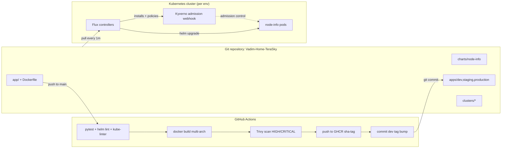
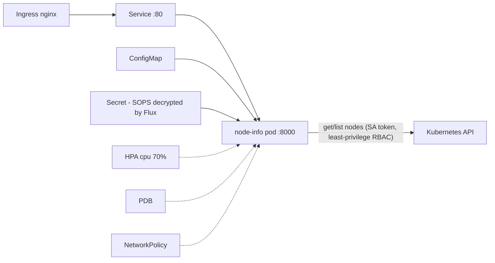
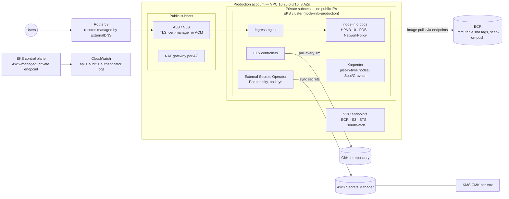
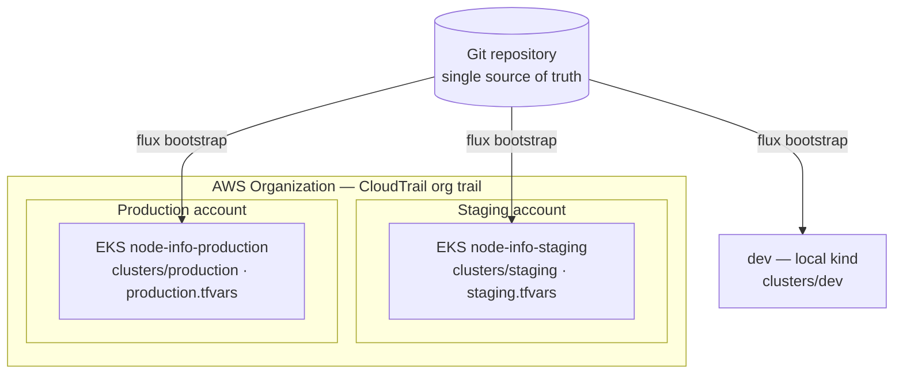

# Vadim-Home-TeraSky — Kubernetes GitOps Platform

Reference implementation for the DevOps Engineer home assignment: a Python
backend deployed to Kubernetes via **Flux GitOps**, with CI on GitHub Actions,
SOPS-encrypted secrets, and Kyverno policy enforcement. This README is the
single document for the whole solution.

<!-- Assignment §8: Architecture diagram -->
## Architecture



Runtime (per environment namespace):



<!-- Assignment §2: Application — /health, /nodes with current-node marking, dedicated ServiceAccount with least-privilege RBAC -->
## The application

`GET /health` — liveness/readiness endpoint (no downstream dependencies, by design).
`GET /nodes` — lists cluster nodes, marks the node the serving pod runs on
(`NODE_NAME` injected via the Downward API `spec.nodeName`).
`GET /metrics` — Prometheus metrics (request count + latency histograms).

The pod authenticates to the Kubernetes API with a dedicated ServiceAccount
bound to a ClusterRole allowing only `get`/`list` on `nodes` (ClusterRole
because nodes are cluster-scoped; read-only, single resource). Verified:

```bash
kubectl auth can-i list nodes   --as=system:serviceaccount:node-info-dev:node-info   # yes
kubectl auth can-i list secrets --as=system:serviceaccount:node-info-dev:node-info -A # no
```

## Repository layout

```
app/                        Python/FastAPI service + unit tests
Dockerfile                  multi-stage, non-root (USER 10001)
charts/node-info/           Helm chart (all Kubernetes objects, see below)
apps/base/node-info/        Flux HelmRelease (chart from this repo)
apps/{dev,staging,production}/  env overlay: namespace, SOPS secret,
                            values-<env>.yaml + pinned image tag
apps/{staging,production}/eso/  ExternalSecret + SecretStore (EKS, dormant)
clusters/dev/               Flux entry points — local kind cluster (live)
clusters/{staging,production}/  Flux entry points — EKS clusters (by design)
infrastructure/controllers/ Kyverno + Reloader (Flux HelmReleases)
infrastructure/policies/    5 enforcing ClusterPolicies
infrastructure/monitoring/  kube-prometheus-stack — toggled per cluster
infrastructure/eso/         External Secrets Operator — dormant, for EKS
infra/terraform/            AWS IaC: VPC, EKS, ECR, KMS, Pod Identity
kind-config.yaml            3-node local cluster config
```

<!-- Assignment §3: Kubernetes requirements — namespaces, Deployment, Service, Ingress, ConfigMap, Secret, SA, ClusterRole/Binding, resources, probes, SecurityContext, HPA, PDB, NetworkPolicy, env-specific config -->
## Kubernetes design

Everything the workload needs is one Helm chart (`charts/node-info/`),
rendered per environment by Flux:

- **Namespace per environment** (created by the env overlays)
- **Deployment** — RollingUpdate `maxSurge: 1, maxUnavailable: 0`; Downward
  API for `NODE_NAME`; config checksum annotation rolls pods on change;
  Reloader annotation rolls pods on Secret change
- **Service** (ClusterIP) and **Ingress** (enabled in staging/production;
  TLS + cert-manager annotations in production)
- **ConfigMap** for app settings; **Secret** referenced, never templated —
  the chart consumes an externally managed Secret (SOPS or ESO)
- **ServiceAccount + ClusterRole + ClusterRoleBinding** — least privilege;
  cluster-scoped names embed the namespace so the chart installs N times
  per cluster without collisions
- **Resource requests/limits**, **liveness + readiness probes**,
  **SecurityContext** (runAsNonRoot, readOnlyRootFilesystem, drop ALL
  capabilities, seccomp RuntimeDefault)
- **HPA** (CPU-based; the chart omits `replicas` when HPA is on so
  reconciliation never fights the autoscaler), **PDB**
  (`unhealthyPodEvictionPolicy: AlwaysAllow`), **NetworkPolicy**
  (ingress only from the ingress controller; egress only DNS + API server)

<!-- Assignment §8: README with deployment instructions -->
## Running locally (kind)

```bash
# 1. Cluster
kind create cluster --name vadim-kind-cluster --config kind-config.yaml

# 2. SOPS decryption key (out-of-band, never in Git)
kubectl create ns flux-system
kubectl -n flux-system create secret generic sops-age \
  --from-file=age.agekey=$HOME/.config/sops/age/terasky-dev.txt

# 3. Bootstrap Flux (installs controllers, then everything reconciles from Git)
flux bootstrap github --owner=<github-owner> --repository=Vadim-Home-TeraSky \
  --branch=main --path=clusters/dev --personal --token-auth

# 4. GHCR pull secret (dev convenience; production uses IAM, see below)
kubectl -n node-info-dev create secret docker-registry ghcr-pull \
  --docker-server=ghcr.io --docker-username=<user> --docker-password=<PAT with read:packages>

# 5. Verify
flux get kustomizations
kubectl -n node-info-dev port-forward svc/node-info 8080:80
curl localhost:8080/nodes
```

## Provisioning staging/production (EKS)

Each promoted environment is its own EKS cluster, created from the same
Terraform with its env tfvars, then handed to Flux:

```bash
cd infra/terraform
terraform apply -var-file=staging.tfvars        # or production.tfvars

aws eks update-kubeconfig --name node-info-staging
kubectl create ns flux-system
kubectl -n flux-system create secret generic sops-age \
  --from-file=age.agekey=<staging age private key>    # per-env key, see .sops.yaml
flux bootstrap github --owner=<github-owner> --repository=Vadim-Home-TeraSky \
  --branch=main --path=clusters/staging --token-auth
```

From that point the cluster reconciles `apps/staging` (or `apps/production`)
from Git, same as dev.

<!-- Assignment §4: GitOps and CI/CD — Flux, repo structure, promotion, pipeline, build/test/scan/push, tagging, update strategy, rollback, reconciliation and drift -->
## CI/CD and promotion

- **CI never touches the cluster.** It tests, builds, scans, pushes the image,
  and commits the new tag for dev. Flux is the only deployer.
- **Policy checks run twice, in two roles.** CI runs `kyverno apply` against
  the rendered manifests using the *same* ClusterPolicies from
  `infrastructure/policies/` — check-only, an early warning that fails the
  pipeline pre-merge. The cluster then enforces those identical policies for
  real at admission. One policy source, no drift between what CI checks and
  what the webhook blocks (kube-linter adds a second, independent linter on
  top).
- **Validation layers** — each CI gate catches a different class of error
  before merge:

  | Layer | Check | Catches |
  |---|---|---|
  | Code | pytest | logic bugs in the app |
  | Chart | helm lint + template (×3 envs) | broken templates, bad values |
  | Manifest quality | kube-linter | missing probes/limits, security gaps |
  | Policies | kyverno apply (same policies as the cluster) | violations the admission webhook would block post-merge |
  | Overlays | kubectl kustomize + flux build (offline) | broken HelmRelease patches, missing/mis-listed resources — errors that would otherwise only surface in Flux after merge |
  | Image | Trivy | HIGH/CRITICAL CVEs in OS packages and dependencies |

- **Image tags are immutable**: `sha-<short-commit>`. No `latest`, ever
  (Kyverno enforces this in-cluster too).
- **Update strategy**: RollingUpdate with `maxSurge: 1, maxUnavailable: 0` —
  a new pod must pass readiness before an old one is removed (verified: an
  unpullable image left the old pod serving untouched).
- **dev**: auto-deployed — CI commits the tag bump to `apps/dev/`.
- **staging → production**: promotion is a PR copying the proven tag into
  `apps/staging/` / `apps/production/`. Git history is the audit trail.
- **Rollback**: `git revert` of the promotion commit. Additionally,
  helm-controller auto-rolls-back failed upgrades (`remediation`), verified
  live: an unpullable image rolled back after timeout with zero downtime.
- **Drift**: Flux reconciles every 5m; manual `kubectl` changes to managed
  objects are reverted (`driftDetection` enabled for Helm-managed objects);
  `prune: true` removes objects deleted from Git.

<!-- Assignment §3: environment-specific configuration; repo must support dev, staging, production -->
## Environments

| | dev | staging | production |
|---|---|---|---|
| Runs on | local kind cluster (live) | EKS (by design, bootstrapped later) | EKS (by design, bootstrapped later) |
| Replicas (HPA) | 1–2 | 2–4 | 3–10 |
| PDB | disabled (1 replica would block drains) | minAvailable 1 | minAvailable 2 |
| Ingress | none (port-forward) | HTTP | HTTPS + cert-manager |
| Log level | DEBUG | INFO | INFO |
| Deploy gate | auto (CI) | PR | PR |
| Anti-affinity | – | – | spread across nodes |

One cluster per environment, each defined entirely by files in this repo.
**dev** is the local kind cluster and the only one running live.
**staging** and **production** are EKS clusters: their infrastructure is
`infra/terraform/` (one tfvars per env), their Flux entry points are
`clusters/staging` and `clusters/production`, and each decrypts its secrets
with its own age key. Until they are bootstrapped, their configuration is
kept continuously correct by CI, which renders, lints, policy-checks, and
builds all three environments on every change.

<!-- Assignment §5 (extra credit): secrets management — where stored, how consumed, access control, per-env separation, rotation; policy-as-code with meaningful policies -->
## Security: secrets, RBAC, policy-as-code

### Secrets (implemented: SOPS + [age](https://github.com/FiloSottile/age))

age is the file-encryption tool SOPS uses here for key management; the
lowercase name is the project's official spelling.

- **Where stored:** encrypted in Git (`apps/<env>/*.enc.yaml`). Only the
  values are ciphertext; metadata stays diffable. Private age keys are
  never in Git.
- **How workloads consume them:** Flux decrypts at apply time using the
  `sops-age` secret in `flux-system`; the decrypted Secret exists only
  inside the cluster; the chart references it via `envFrom`.
- **Access control:** encrypt = repo + public keys; decrypt = only holders
  of the private key. A full Git compromise leaks ciphertext only.
- **Environment separation:** one age keypair per environment — the dev
  key cannot decrypt staging/production files (per-path rules in
  `.sops.yaml`).
- **Rotation:** edit with `sops`, commit → Flux applies the new Secret →
  Reloader (installed) rolls the pods automatically. Key rotation:
  `sops updatekeys` + replace the cluster's `sops-age` secret.

### Production secrets (prepared, dormant): ESO + AWS Secrets Manager

The full chain exists as code for the EKS clusters. Terraform creates the
Secrets Manager container (`<env>/node-info`), the ESO IAM role (read-only
on that env's path), and the Pod Identity association. GitOps holds the
rest: `infrastructure/eso/` installs the operator; `apps/<env>/eso/` holds
the SecretStore + ExternalSecret syncing into the same Secret the app
already reads — activated by `clusters/<env>/eso.yaml` at bootstrap.
Rotation then happens in AWS with no Git involvement: ESO re-syncs within
a minute, Reloader rolls the pods, CloudTrail audits access. Enabling ESO
replaces the SOPS-managed Secret (remove the `.enc.yaml` in the same
change). SOPS remains for bootstrap secrets that must exist before ESO.

### Policy-as-code (Kyverno, Enforce mode)

Installed by Flux before the apps (`dependsOn` ordering); all policies
block at admission — verified live against `nginx:latest` and a
privileged pod.

| Policy | Blocks | Rationale |
|---|---|---|
| disallow-latest-tag | untagged / `:latest` images | mutable tags break rollback + reproducibility |
| require-requests-limits | pods without CPU/mem requests+limits | scheduling, HPA, noisy-neighbour protection |
| require-probes | missing liveness/readiness | rollout safety, self-healing |
| require-run-as-nonroot | root containers | container escape ≠ node root |
| disallow-privileged | privileged / escalation | node takeover prevention |

Platform namespaces (kube-system, flux-system, kyverno, reloader,
monitoring) are excluded — third-party system charts are not ours to
patch. The same policy files run in CI (`kyverno apply`) as a pre-merge
check. Supply-chain next step: cosign-sign images in CI; Kyverno
`verifyImages` admits only our CI's signatures.

<!-- Assignment §6: Monitoring and logging — app metrics, workload monitoring, cluster monitoring, centralized logging, alerting, incident investigation, 3+ example alerts -->
## Monitoring and logging

The stack ships as code and is toggled per cluster
(`clusters/<env>/monitoring.yaml`; enabled on dev):
kube-prometheus-stack (Prometheus, Grafana, Alertmanager,
kube-state-metrics, node-exporter) sized small for the demo — 24h
retention, control-plane scrapers off, bounded resources.

| Layer | Tool | Why |
|---|---|---|
| Metrics | Prometheus (Operator) | standard; ServiceMonitor CRDs manage scraping |
| Dashboards | Grafana | provisioned dashboards as code |
| Alert routing | Alertmanager → Slack/PagerDuty | dedup, grouping, silences |
| Logs | Loki + promtail (or Fluent Bit → CloudWatch on EKS) | label-based, cheap; stdout only — no log files in pods |
| Traces (later) | OpenTelemetry → Tempo/X-Ray | when service count justifies it |

**Application metrics** — the app exposes `/metrics`:
`http_requests_total{method,path,status}` (traffic + error rate) and
`http_request_duration_seconds` (latency histograms → p95/p99). The chart
carries a gated ServiceMonitor + PrometheusRule (`monitoring.enabled`)
with three alerts as code, each with runbook annotations. Workload and
cluster monitoring come from kube-state-metrics and node-exporter.

**Example alerts (PromQL):**

```yaml
# 1. High 5xx error rate (>5% for 5m) — implemented in the chart
- alert: NodeInfoHighErrorRate
  expr: |
    sum(rate(http_requests_total{status=~"5..", job="node-info"}[5m]))
      / sum(rate(http_requests_total{job="node-info"}[5m])) > 0.05
  for: 5m

# 2. Pod crash looping — implemented in the chart
- alert: PodCrashLooping
  expr: increase(kube_pod_container_status_restarts_total[15m]) > 3
  for: 5m

# 3. Deployment below desired replicas — implemented in the chart
- alert: DeploymentUnavailable
  expr: |
    kube_deployment_status_replicas_available{deployment="node-info"}
      < kube_deployment_spec_replicas{deployment="node-info"}
  for: 10m

# 4. HPA pinned at max (cannot scale further)
- alert: HPAMaxedOut
  expr: |
    kube_horizontalpodautoscaler_status_current_replicas
      >= kube_horizontalpodautoscaler_spec_max_replicas
  for: 15m

# 5. High p95 latency
- alert: NodeInfoSlowRequests
  expr: |
    histogram_quantile(0.95,
      sum(rate(http_request_duration_seconds_bucket{job="node-info"}[5m])) by (le)
    ) > 0.5
  for: 10m

# 6. Node memory pressure
- alert: NodeMemoryPressure
  expr: kube_node_status_condition{condition="MemoryPressure",status="true"} == 1
  for: 5m
```

**Incident investigation flow:** alert fires (runbook link) → Grafana
error-rate/latency panels → Loki logs filtered to the window → pod
describe/events → "was there a deploy?" via `flux get helmreleases` + the
overlay's git log → `git revert` is the rollback.

**Access on dev:** `kubectl -n monitoring port-forward
svc/kube-prometheus-stack-grafana 3000:80` → http://localhost:3000.
Without the stack, `/metrics` is directly observable via port-forward.

<!-- Assignment §7: Cloud production design — cluster architecture, networking, ingress/DNS/TLS, IAM/workload identity, registry, secrets, env separation, audit, encryption, backup/restore, scaling, cost, DR -->
## Production design — AWS / EKS

This is the design of the **staging and production environments** — not a
hypothetical: their infrastructure is `infra/terraform/` (staging.tfvars /
production.tfvars) and their GitOps entry points are `clusters/staging` and
`clusters/production`, ready to bootstrap.



Everything inbound passes one load balancer; everything outbound to AWS
services stays inside the VPC through endpoints; the only thing that ever
"deploys" is Flux pulling Git.



One repo drives all three clusters; the isolation boundary between
environments is an AWS account, not a namespace.

**Cluster architecture.** One EKS cluster per promoted environment, in its
own AWS account (blast-radius isolation, account-level IAM and audit,
clean cost attribution). 3 AZs; nodes in private subnets; managed add-ons
pinned in Terraform; everything else installed by Flux from
`infrastructure/`.

**Networking.** Public subnets hold only the load balancer and NAT;
nodes/pods have no public IPs and egress via NAT (VPC endpoints for
ECR/S3/STS/CloudWatch keep most traffic inside the VPC). API endpoint
private; human access via SSM, not bastions. NetworkPolicies enforced by
the VPC CNI's policy agent or Cilium.

**Ingress, DNS, TLS.** ingress-nginx behind NLB (keeps manifests
cloud-agnostic, matches the chart) or ALB controller; ExternalDNS manages
Route 53 from Ingress hosts; cert-manager with DNS-01 via Route 53 (or
ACM at the ALB).

**IAM and workload identity.** EKS Pod Identity (implemented in
`infra/terraform/`): ServiceAccount → IAM role via a first-class
association — no OIDC wiring, no annotations; ESO reads only its env's
secrets path. IRSA's OIDC provider kept only for charts without Pod
Identity support. Humans via SSO, read-only by default — changes go
through Git. CI reaches AWS via GitHub OIDC federation, scoped to ECR
push; no long-lived keys.

**Container registry.** ECR per account, immutable tags, scan-on-push;
nodes pull via IAM — no imagePullSecrets in production (the GHCR PAT in
the demo is a local shortcut). Build once, replicate cross-account;
promotion never rebuilds.

**Progressive delivery (documented, not implemented).** Production swaps
the Deployment for an **Argo Rollouts `Rollout`** (same pod spec). New
versions receive 10% → 50% → 100% of real traffic; the split is enforced
by the **ALB itself** via target-group weights (no service mesh; App Mesh
is EOL Sept 2026). Between steps, AnalysisTemplates run Prometheus
queries on the app's own `/metrics` (5xx rate, p95); bad numbers roll all
traffic back automatically. Not implemented locally because canary gates
without real traffic prove nothing. Trade-off: the Rollout CRD replaces
the standard Deployment.

**Audit logging.** EKS control-plane logs (api, audit, authenticator) →
CloudWatch; CloudTrail org trail (immutable S3); Git history + Flux
events are the deployment audit trail.

**Encryption.** EKS secrets envelope-encrypted with a per-env KMS CMK;
EBS/S3 encrypted by default; TLS at the LB (in-cluster mTLS only when
compliance demands a mesh).

**Backup and restore.** Velero → S3 for cluster state, but the primary
recovery story is GitOps: fresh cluster + `flux bootstrap` + the sops-age
key restores the stateless tier in minutes. Databases are managed
services with native PITR — no data tier in-cluster.

**Scaling and nodes.** HPA for pods (in the chart); Karpenter for nodes —
just-in-time, consolidation, Spot for stateless workloads (PDB +
anti-affinity already accommodate interruption), Graviton (images are
multi-arch).

**Cost.** Spot + Graviton; Karpenter consolidation; VPC endpoints cut NAT
traffic; single NAT outside production; Kubecost for showback; right-size
requests from Prometheus data.

**Disaster recovery.** Clusters are cattle — re-bootstrap from Git
(proven: this repo rebuilt the demo cluster from zero). Multi-AZ by
default; multi-region only with a business case (ECR replication +
Route 53 failover + a warm standby reconciling the same repo). Runbook:
Terraform → restore sops-age/ESO IAM → flux bootstrap → verify → shift
DNS. Target < 1h for the stateless tier.

**Infrastructure as code.** Terraform owns "the platform exists"; Flux
owns "what runs on it". The boundary is the cluster API — Terraform never
applies Kubernetes manifests beyond Flux's bootstrap.

<!-- Assignment §8: assumptions, design decisions, trade-offs, known limitations, production recommendations -->
## Assumptions

- One stateless service, one team. No data tier lives in-cluster (databases
  would be managed services), so backup/DR reduces to Git + re-bootstrap.
- GHCR is the registry today; ECR migration lands with the EKS clusters
  (images are multi-arch and registry-agnostic, so this is a config change).
- Secret change cadence is low — SOPS fits until rotation frequency or
  audit requirements trigger the move to External Secrets Operator.
- dev runs on local kind; staging/production EKS configurations are
  exercised only by CI until their clusters are bootstrapped.

## Design decisions & trade-offs

| Decision | Why | Trade-off accepted |
|---|---|---|
| Helm chart rendered by Flux HelmRelease | One chart, per-env values; helm-controller runs real Helm upgrades with retries and automatic rollback | More moving parts than plain Kustomize; failures surface in HelmRelease status, one layer removed from kubectl |
| Monorepo (app + chart + GitOps state) | Atomic changes and a single audit trail across code, chart, and env config — no cross-repo version skew | At team scale, app and platform split into separate repos for permission boundaries and smaller CI blast radius |
| Deploys are Git commits written by CI (not Flux Image Automation) | Every deploy is a reviewable, revertable commit; no registry-polling controllers | One extra CI job; Image Automation suits teams wanting zero-touch dev deploys |
| SOPS + [age](https://github.com/FiloSottile/age) keys now, ESO as target state | Secrets exist from day zero with no external service dependency; a full Git compromise leaks only ciphertext | Rotation is re-encrypt + commit + restart; no per-access audit — the trigger for moving to ESO + Secrets Manager |
| Cluster per promoted environment | Control-plane blast-radius isolation; staging rehearses cluster upgrades before production; account-level IAM and audit boundaries | Extra control planes, NAT/egress cost, more clusters to patch |
| dev on local kind | Live, fully reproducible environment for this submission — the whole platform rebuilds from this repo on any machine, no cloud account needed | Parity gaps vs EKS: kindnet doesn't enforce NetworkPolicy; no cloud LB or IAM locally |
| Chart installs N times per cluster (cluster-scoped names embed the namespace) | Keeps shared clusters possible where they belong: preview environments, shared dev | Longer resource names |
| `replicas` omitted when HPA enabled | Reconciliation must never fight the autoscaler — a Git-driven replica reset mid-spike drops live capacity | Initial scale is expressed only via HPA minReplicas |
| Kyverno over OPA Gatekeeper | Policies are plain YAML the whole team can review; the same policy files run in CI and at admission | Rego is more expressive for complex cross-object logic |
| Progressive delivery documented, not implemented (Argo Rollouts + ALB weights) | Canary gates judge real traffic — on a cluster with none, they prove nothing; this belongs to the EKS stage | Production replaces the standard Deployment with the Rollout CRD when adopted |

## Known limitations

- kind's default CNI (kindnet) does not enforce NetworkPolicy — the manifests
  are correct but only enforced on Calico/Cilium/cloud CNIs.
- The GHCR pull secret is a personal token: dev-only convenience. Production
  uses IAM-based registry auth (no long-lived secrets).
- No TLS locally (no ingress controller installed on kind by default).
- staging/production exist as complete, CI-verified configuration, but no
  cluster has run them yet. CI proves everything renders and builds; it
  cannot prove runtime behavior (controllers starting, cloud
  integrations). Plan: bootstrap staging first and shake it down before
  trusting the same flow for production.
- Secret values reach pods as env vars, snapshotted at container start.
  Reloader (installed, `infrastructure/controllers/`) rolls pods
  automatically when a Secret changes; external rotation is the ESO path.

## Production recommendations

Cosign image signing + Kyverno verifyImages, ESO with AWS Secrets Manager
(prepared — see Security), separate EKS clusters per environment,
Karpenter node provisioning, kube-prometheus-stack + Loki + Alertmanager,
and Velero backups.

### Prioritized next steps on EKS

**Networking & cost (cheap wins first):**
- **VPC endpoints** for ECR, S3, STS, CloudWatch — image pulls and telemetry
  stop transiting NAT gateways: cuts the NAT bill and keeps cluster traffic
  inside the VPC. The most-forgotten item in EKS designs.
- **NodeLocal DNSCache + CoreDNS autoscaling** — DNS is the first thing that
  melts under load on EKS; the `kubernetes` client in this app does lookups
  on every API call.
- **Topology spread constraints across AZs** for production — the current pod
  anti-affinity spreads across *nodes*; `topology.kubernetes.io/zone` spread
  is what actually survives an AZ event.

**Security (managed-first):**
- **EKS Pod Identity — already implemented** (chosen over IRSA): see
  `infra/terraform/`. The legacy IRSA OIDC provider is intentionally kept
  as a fallback for third-party charts that don't support Pod Identity yet.
- **Bottlerocket AMIs** for nodes — minimal, immutable, API-driven OS;
  shrinks patching scope dramatically and pairs well with Karpenter.
- **GuardDuty EKS Runtime Monitoring** — managed runtime threat detection
  (crypto-miners, reverse shells) instead of self-hosting Falco.
- **Pod Security Admission** (`restricted` profile via namespace labels) as
  the built-in floor under Kyverno — defense in depth for one label per
  namespace.
- **checkov/tfsec in CI for the Terraform** — the pipeline lints Kubernetes
  manifests but not the IaC; policy-as-code should cover both.

**Observability:**
- **Alerting to humans** — wire Flux's notification-controller and
  Alertmanager to Slack/PagerDuty; a failed reconciliation in production
  must page someone, not sit silently in a status field.

**Delivery:**
- **Canary releases with Argo Rollouts + ALB weights** — documented above
  (Production design); the adoption step is swapping the Deployment for a
  Rollout in the production overlay.
