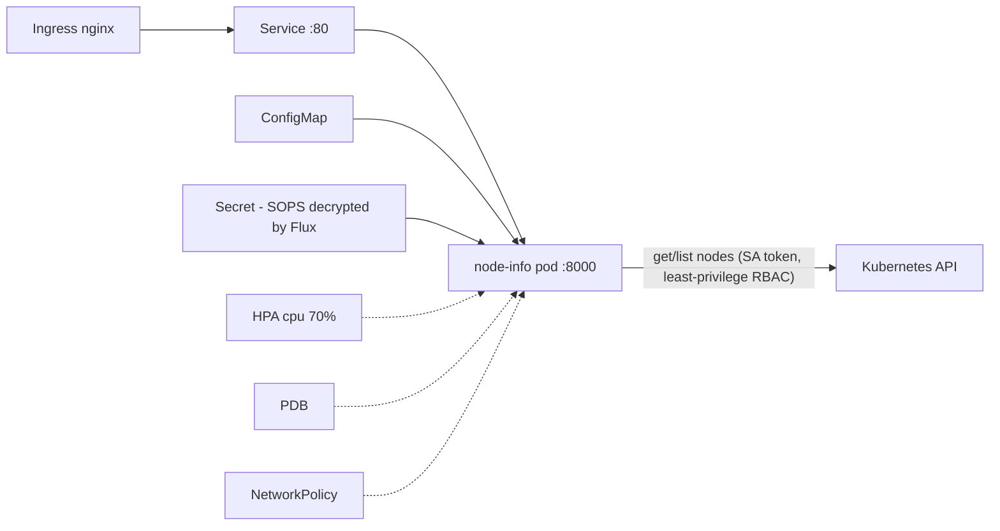

# Vadim-Home-TeraSky — Kubernetes GitOps Platform

Reference implementation for the DevOps Engineer home assignment: a Python
backend deployed to Kubernetes via **Flux GitOps**, with CI on GitHub Actions,
SOPS-encrypted secrets, and Kyverno policy enforcement.

## Architecture


Runtime (per environment namespace):



## The application

`GET /health` — liveness/readiness endpoint (no downstream dependencies, by design).
`GET /nodes` — lists cluster nodes, marks the node the serving pod runs on
(`NODE_NAME` injected via the Downward API `spec.nodeName`).
`GET /metrics` — Prometheus metrics (request count + latency histograms).

The pod authenticates to the Kubernetes API with a dedicated ServiceAccount
bound to a ClusterRole allowing only `get`/`list` on `nodes` (ClusterRole
because nodes are cluster-scoped; read-only, single resource).

## Repository layout

```
app/                        Python/FastAPI service + unit tests
Dockerfile                  multi-stage, non-root (USER 10001)
charts/node-info/           Helm chart: SA, ClusterRole/Binding, Deployment,
                            Service, Ingress, ConfigMap, HPA, PDB,
                            NetworkPolicy, SecurityContext, probes, resources
apps/base/node-info/        Flux HelmRelease (chart from this repo)
apps/{dev,staging,production}/  env overlay: namespace, SOPS secret,
                            values-<env>.yaml + pinned image tag
clusters/dev/               Flux entry points — local kind cluster (live)
clusters/{staging,production}/  Flux entry points — EKS clusters (by design)
infrastructure/controllers/ Kyverno (Flux HelmRelease)
infrastructure/policies/    5 enforcing ClusterPolicies
infrastructure/flagger/     blue/green controller — dormant locally,
                            activated by clusters/production/flagger.yaml
infrastructure/monitoring/  kube-prometheus-stack — dormant locally,
                            suspended Kustomization in clusters/dev/monitoring.yaml
infra/terraform/            AWS reference IaC: VPC, EKS, ECR, KMS, Pod Identity
kind-config.yaml            3-node local cluster config
docs/                       monitoring, security/secrets, AWS production design
```

## Running locally (kind)

```bash
# 1. Cluster
kind create cluster --name vadim-kind-cluster --config kind-config.yaml

# 2. SOPS decryption key (out-of-band, never in Git)
kubectl create ns flux-system
kubectl -n flux-system create secret generic sops-age \
  --from-file=age.agekey=$HOME/.config/sops/age/terasky-dev.txt

# 3. Bootstrap Flux (installs controllers, then everything reconciles from Git)
flux bootstrap github --owner=cloudor-devops --repository=Vadim-Home-TeraSky \
  --branch=main --path=clusters/dev --personal --token-auth

# 4. GHCR pull secret (dev convenience; production uses IAM, see docs)
kubectl -n node-info-dev create secret docker-registry ghcr-pull \
  --docker-server=ghcr.io --docker-username=<user> --docker-password=<PAT with read:packages>

# 5. Verify
flux get kustomizations          # flux-system, infra-controllers, infra-policies, apps
kubectl -n node-info-dev port-forward svc/node-info 8080:80
curl localhost:8080/nodes
```

## Provisioning staging/production (EKS)

Each promoted environment is its own EKS cluster, created from the same
Terraform with its env tfvars, then handed to Flux:

```bash
cd infra/terraform
terraform apply -var-file=staging.tfvars        # or production.tfvars

aws eks update-kubeconfig --name node-info-staging
kubectl create ns flux-system
kubectl -n flux-system create secret generic sops-age \
  --from-file=age.agekey=<staging age private key>    # per-env key, see .sops.yaml
flux bootstrap github --owner=cloudor-devops --repository=Vadim-Home-TeraSky \
  --branch=main --path=clusters/staging --token-auth
```

From that point the cluster reconciles `apps/staging` (or `apps/production`,
including the Flagger blue/green add-on) from Git, same as dev.

## CI/CD and promotion

- **CI never touches the cluster.** It tests, builds, scans, pushes the image,
  and commits the new tag for dev. Flux is the only deployer.
- **Policy checks run twice, in two roles.** CI runs `kyverno apply` against
  the rendered manifests using the *same* ClusterPolicies from
  `infrastructure/policies/` — check-only, an early warning that fails the
  pipeline pre-merge. The cluster then enforces those identical policies for
  real at admission. One policy source, no drift between what CI checks and
  what the webhook blocks (kube-linter adds a second, independent linter on
  top).
- **Validation layers** — each CI gate catches a different class of error
  before merge:

  | Layer | Check | Catches |
  |---|---|---|
  | Code | pytest | logic bugs in the app |
  | Chart | helm lint + template (×3 envs) | broken templates, bad values |
  | Manifest quality | kube-linter | missing probes/limits, security gaps |
  | Policies | kyverno apply (same policies as the cluster) | violations the admission webhook would block post-merge |
  | Overlays | kubectl kustomize + flux build (offline) | broken HelmRelease patches, missing/mis-listed resources — errors that would otherwise only surface in Flux after merge |
  | Image | Trivy | HIGH/CRITICAL CVEs in OS packages and dependencies |

- **Image tags are immutable**: `sha-<short-commit>`. No `latest`, ever
  (Kyverno enforces this in-cluster too).
- **Update strategy**: RollingUpdate with `maxSurge: 1, maxUnavailable: 0` —
  a new pod must pass readiness before an old one is removed (verified: an
  unpullable image left the old pod serving untouched).
- **dev**: auto-deployed — CI commits the tag bump to `apps/dev/`.
- **staging → production**: promotion is a PR copying the proven tag into
  `apps/staging/` / `apps/production/`. Git history is the audit trail.
- **Rollback**: `git revert` of the promotion commit. Additionally,
  helm-controller auto-rolls-back failed upgrades (`remediation`), verified
  live: an unpullable image rolled back after timeout with zero downtime.
- **Drift**: Flux reconciles every 5m; manual `kubectl` changes to managed
  objects are reverted; `prune: true` removes objects deleted from Git.

## Environments

| | dev | staging | production |
|---|---|---|---|
| Runs on | local kind cluster (live) | EKS (by design, bootstrapped later) | EKS (by design, bootstrapped later) |
| Replicas (HPA) | 1–2 | 2–4 | 3–10 |
| PDB | disabled (1 replica would block drains) | minAvailable 1 | minAvailable 2 |
| Ingress | none (port-forward) | HTTP | HTTPS + cert-manager |
| Log level | DEBUG | INFO | INFO |
| Deploy gate | auto (CI) | PR | PR |
| Anti-affinity | – | – | spread across nodes |

One cluster per environment, each defined entirely by files in this repo.
**dev** is the local kind cluster and the only one running live.
**staging** and **production** are EKS clusters: their infrastructure is
`infra/terraform/` (one tfvars per env), their Flux entry points are
`clusters/staging` and `clusters/production`, and each decrypts its secrets
with its own age key. Until they are bootstrapped, their configuration is
kept continuously correct by CI, which renders, lints, policy-checks, and
builds all three environments on every change (see Validation layers).

## Assumptions

- Single Git repo (monorepo) for app + chart + GitOps state: simplest to
  review; a real org would split app and platform repos (see Trade-offs).
- dev runs live on local kind; staging/production are designed as EKS
  clusters and not provisioned for this demo (no AWS account required to
  review) — their configs are validated by CI on every change.
- GHCR package stays private; local pulls use a PAT-based secret.

## Design decisions & trade-offs

| Decision | Why | Trade-off accepted |
|---|---|---|
| Helm chart rendered by Flux HelmRelease | Templating + per-env values; helm-controller gives atomic upgrades, retries, auto-rollback | More moving parts than plain Kustomize |
| Monorepo | One PR shows the whole flow | Prod would split repos to separate app/platform permissions |
| CI bumps dev tag by commit (not Flux Image Automation) | Fewer controllers, explicit audit trail | Extra CI job; Image Automation documented as alternative |
| SOPS+age (implemented) over ESO (documented) | Fully demonstrable offline; Flux-native decryption | Rotation requires re-encrypt+commit; ESO is the production path |
| ClusterRole per release (name includes namespace) | dev/staging/prod can share a cluster without collisions | Slightly longer names |
| `replicas` omitted when HPA enabled | `helm upgrade` must not fight the autoscaler | Initial replica count is HPA minReplicas |
| Kyverno over OPA Gatekeeper | Native YAML policies, no Rego learning curve | Rego is more expressive for complex rules |
| dev on kind, staging/prod as EKS-by-design | Honest isolation model — envs are clusters, not namespaces | staging/prod not demonstrable live; verified by CI + Terraform/docs |

## Known limitations

- kind's default CNI (kindnet) does not enforce NetworkPolicy — the manifests
  are correct but only enforced on Calico/Cilium/cloud CNIs.
- The GHCR pull secret is a personal token: dev-only convenience. Production
  uses IAM-based registry auth (no long-lived secrets).
- No TLS locally (no ingress controller installed on kind by default).
- staging/production are not demonstrable live: they exist as complete,
  CI-verified configuration until their EKS clusters are bootstrapped.
  Trade-off accepted deliberately — a namespaces-on-one-cluster demo was
  rejected because it misrepresents the isolation model.
- Secret rotation requires a pod restart (env vars snapshot at start);
  production would add stakater/reloader or ESO with rotation.

## Production recommendations (summary — full detail in docs/)

Cosign image signing + Kyverno verifyImages, ESO with AWS Secrets Manager,
separate EKS clusters per environment, Karpenter node provisioning,
kube-prometheus-stack + Loki + Alertmanager, and Velero backups.

### Prioritized next steps on EKS

**Networking & cost (cheap wins first):**
- **VPC endpoints** for ECR, S3, STS, CloudWatch — image pulls and telemetry
  stop transiting NAT gateways: cuts the NAT bill and keeps cluster traffic
  inside the VPC. The most-forgotten item in EKS designs.
- **NodeLocal DNSCache + CoreDNS autoscaling** — DNS is the first thing that
  melts under load on EKS; the `kubernetes` client in this app does lookups
  on every API call.
- **Topology spread constraints across AZs** for production — the current pod
  anti-affinity spreads across *nodes*; `topology.kubernetes.io/zone` spread
  is what actually survives an AZ event.

**Security (managed-first):**
- **EKS Pod Identity — already implemented** (chosen over IRSA): same
  outcome (IAM role per ServiceAccount) with less ceremony (no per-cluster
  OIDC trust wiring). See `infra/terraform/`: the Pod Identity agent addon
  plus an association binding the ESO ServiceAccount to its least-privilege
  role. The legacy IRSA OIDC provider is intentionally kept as a fallback
  for third-party charts that don't support Pod Identity yet.
- **Bottlerocket AMIs** for nodes — minimal, immutable, API-driven OS;
  shrinks patching scope dramatically and pairs well with Karpenter.
- **GuardDuty EKS Runtime Monitoring** — managed runtime threat detection
  (crypto-miners, reverse shells) instead of self-hosting Falco.
- **Pod Security Admission** (`restricted` profile via namespace labels) as
  the built-in floor under Kyverno — defense in depth for one label per
  namespace.
- **checkov/tfsec in CI for the Terraform** — the pipeline lints Kubernetes
  manifests but not the IaC; policy-as-code should cover both.

**Observability:**
- **Monitoring stack as code, dormant locally** — kube-prometheus-stack is
  defined in `infrastructure/monitoring/` (small footprint: 24h retention,
  control-plane scrapers off, bounded resources) behind a *suspended* Flux
  Kustomization (`clusters/dev/monitoring.yaml`). Enabling it is a one-line
  change (`suspend: false`) plus flipping `monitoring.enabled` in the chart
  values, which adds a ServiceMonitor for `/metrics` and a PrometheusRule
  carrying the three alerts from `docs/monitoring.md` (high 5xx rate, crash
  looping, deployment below desired replicas) with runbook annotations.
  Without the stack, `/metrics` is still demonstrable via port-forward.

**Delivery:**
- **Flagger blue/green for production** — configuration is prepared in this
  repo: `infrastructure/flagger/` (controller) and `apps/production/flagger/`
  (Canary with error-rate and p95-latency gates against the app's own
  `/metrics`), activated by `clusters/production/flagger.yaml` when the real
  production cluster is bootstrapped. Green must pass analysis before the
  Service selector switches atomically; failure = automatic rollback while
  blue keeps serving. Staging should run the same mechanism (looser gates)
  for pipeline parity. Not enabled on the local demo cluster: analysis gates
  without real traffic prove nothing.

- `docs/monitoring.md` — metrics, logging, alerting design with PromQL
- `docs/security.md` — secrets management, RBAC, policy-as-code
- `docs/production-aws.md` — EKS production architecture
